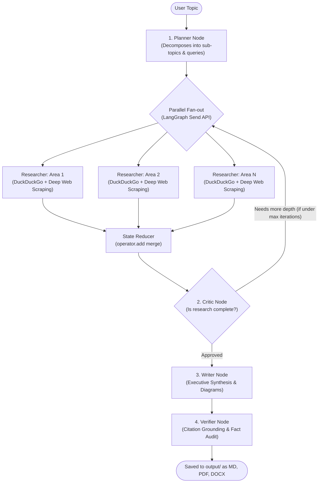

# Autonomous Deep Research Agent with LangGraph & NVIDIA NIM

An autonomous, multi-agent deep research system built with **LangGraph** and powered by **NVIDIA NIM** LLMs (`meta/llama-3.3-70b-instruct`).

The agent decomposes any research question, fans out to parallel web researchers using LangGraph's dynamic `Send` API, reflects on findings via a Critic/Reviewer node with self-healing feedback loops, and synthesizes an executive Markdown report with citations.

---

## 🏗️ Architecture




---

## ⚡ Quick Start

### 1. Prerequisites & Virtual Environment

A virtual environment is already configured in `.venv/`. If setting up on a new machine:
```bash
uv venv
.\.venv\Scripts\activate
uv pip install -r requirements.txt
```

### 2. Configure Your NVIDIA API Key

Create a `.env` file in the root directory (or copy from `.env.example`):
```bash
cp .env.example .env
```

Set your NVIDIA API key in `.env`:
```env
NVIDIA_API_KEY=nvapi-your-key-here
NVIDIA_MODEL=meta/llama-3.3-70b-instruct
MAX_RESEARCH_ITERATIONS=1
MAX_SEARCH_RESULTS_PER_QUERY=4
```
> **Tip:** You can obtain a free NVIDIA API key with complimentary credits at [build.nvidia.com](https://build.nvidia.com/).

### 3. Run with Docker (Recommended)

Build and spin up the complete application container with Docker Compose:
```bash
docker compose up -d --build
```
- Web UI: **`http://localhost:8501`**
- All generated research reports are automatically synchronized to your host `./output` directory.
- Container healthchecks monitor uptime automatically.

To check logs or stop:
```bash
# View logs
docker compose logs -f

# Stop container
docker compose down
```

---

### 4. Run Locally (Without Docker)

**🌐 Web Interface (Streamlit):**
```bash
.\.venv\Scripts\streamlit.exe run streamlit_app.py
```
Open **`http://localhost:8501`** in your browser.

**💻 Interactive Terminal Mode:**
```bash
.\.venv\Scripts\python.exe main.py
```

**⚡ Direct CLI Mode:**
```bash
.\.venv\Scripts\python.exe main.py --topic "State of Reasoning LLMs in 2026: Architectures, RLVR, and Test-Time Compute"
```

Generated reports are automatically formatted in GitHub-flavored Markdown with complete bibliography citations and saved into the `output/` directory.

---

## 🧩 Project Structure

```text
AgenticLanggraph/
├── .env.example           # Example environment variables
├── requirements.txt       # Dependencies
├── main.py                # Main CLI entry point
├── streamlit_app.py       # Full-featured Streamlit Dashboard & Chat UI
├── src/
│   ├── config.py          # Settings & NVIDIA NIM client configuration
│   ├── state.py           # TypedDict states & Pydantic output schemas
│   ├── tools/
│   │   ├── search.py      # Resilient DuckDuckGo web search tool
│   │   ├── scraper.py     # Dual-tier web scraper (Jina Reader + direct lxml)
│   │   └── exporter.py    # Multi-format exporter (PDF, Word .docx, Mermaid)
│   ├── nodes/
│   │   ├── planner.py     # Decomposes queries into structured subtopics
│   │   ├── researcher.py  # Map-worker node searching, scraping & synthesizing
│   │   ├── reviewer.py    # Critic node evaluating thoroughness & gaps
│   │   ├── writer.py      # Executive report synthesizer
│   │   └── verifier.py    # Citation grounding & hallucination auditing node
│   ├── graph.py           # LangGraph StateGraph assembly & Send API routing
│   └── cli.py             # Rich terminal UI & streaming execution
└── output/                # Markdown (.md), PDF (.pdf), Word (.docx), & checkpoints.db
```
